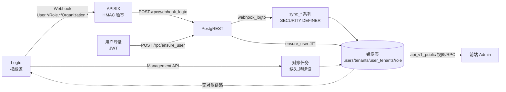

# 33 Logto 镜像表同步与对账审查清单

> 审查日期：2026-08-10
> 审查范围：`users` / `tenants` / `user_tenants` / `role` / `user_role` 五张 Logto 镜像表的设计、webhook 同步链路、PostgREST 暴露接口、以及是否需要与 Logto 对账。
> 审查结论：**必须引入与 Logto 的对账机制**。当前"webhook 单向推送 + JIT 兜底"的模型存在多个 P0 级数据漂移点，且已有 3 处确定的代码缺陷（含用户已发现的 3 个问题的根因）。

---

## 1. 审查范围与数据流

**当前同步链路（实际生效的）**：

| 链路 | 实现 | 状态 |
|---|---|---|
| 用户增改 | `User.Created` / `User.Data.Updated` → `sync_user_upsert` | 生效，但有字段缺口 |
| 用户删除 | `User.Deleted` → `sync_user_delete` | **失效（P0）** |
| 组织增改 | `Organization.Created` / `Data.Updated` → `sync_tenant_upsert` | 生效 |
| 组织删除 | `Organization.Deleted` → `sync_tenant_delete` | **失效（P0）** |
| 成员变更 | `Organization.Membership.Updated` → `sync_membership_delta` | 生效，但 5000 截断处理错误 |
| 全局角色增改 | `Role.Created` / `Data.Updated` → `sync_role_upsert` | 生效 |
| 全局角色删除 | `Role.Deleted` → `sync_role_delete` | **失效（P0）** |
| 组织角色 | `OrganizationRole.*` | **未订阅、未处理** |
| 用户-角色分配 | 无事件可订阅 → 仅登录 JIT | **无实时通道** |
| 登录日志 | `PostSignIn`（020 已实现分支） | **webhook 未订阅** |
| 封禁状态 | `User.SuspensionStatus.Updated` | **未订阅、未处理** |

---

## 2. 用户已发现的 3 个问题：根因确认

### 问题 1：user 相关接口仍有 add/delete

**现象**：Admin 后端仍暴露/注册用户新增、删除相关接口与权限点。

**根因（3 处叠加）**：

1. **权限点残留**：`db/migrations/public/040_iam_single_code_perms.sql`（§1）给历史 `/sys_user` 端点回填了 `sys:user:add` / `sys:user:delete` 权限码；`003_seed_data.sql` 中 `/sys_user` 的 `POST`/`DELETE` 行也仍在 `iam_api`。`044` 又显式把按钮 `UserAdd/UserDelete` 与接口 `sys:user:add/delete` 绑定。**OmniPG 当前根本没有对应的后端 RPC（`create_user` 已在 015 删除、权限已在 010 §4.2 REVOKE）**，形成了"有按钮、有权限码、无接口"的死权限点。
2. **镜像表视图被 PostgREST 自动暴露写方法**：`api_v1_public.role` 是单表简单视图（自动可更新），PostgREST OpenAPI 中会出现 `POST/PATCH/DELETE /api/v1/sys/role`；`api_v1_public.users` 虽为 JOIN 视图不可更新，但 OpenAPI 仍会展示该方法（调用报错）。同时 `grant_all.sql` §3.5 对 `role_admin` 授予了 `INSERT,UPDATE ON api_v1_public.users / role`，`028` 对 `super_admin` 授予 `ALL ON users, tenants, role, user_tenants`——与"镜像只读"原则直接冲突（目前写被 RLS 无写策略挡住，属"侥幸安全"，是地雷）。
3. **历史 `import_csv` 写路径**：015 版 `import_csv` 的允许表清单是"除 app_config/audit_log/cron_job_log 外全部视图"，**包含 users/role 等镜像视图**，且 `SECURITY DEFINER` 绕过 RLS，任何持 `sys:import`（超管）者可绕过 Logto 直接向镜像表插数据；035 已改为显式业务表白名单修复，但证明"镜像只读"在历史上曾被破坏。

**影响**：接口面与权限模型自相矛盾，前端会渲染无功能的新增/删除按钮；镜像表存在被直接写入的潜在路径（当前依赖 RLS 无写策略兜底）。

**建议**：
- 删除 `iam_api` 中 `/sys_user` 的 POST/DELETE 行与 `sys:user:add/edit/delete` 权限码，或统一改为指向 Logto 控制台/Management API 的外部入口（仅展示）；
- 移除 `UserAdd/UserEdit/UserDelete` 按钮菜单或将其 `api_code` 指向 Logto 管理入口；
- `grant_all.sql` 与 `028` 中镜像表写授权全部撤销（仅保留 SELECT）；
- 评估将 `api_v1_public.role` 视图改为不可更新（加 JOIN/表达式列使其不可自动更新）或通过 `REVOKE INSERT/UPDATE/DELETE` 显式声明只读；
- 更新 `docs/开发实施方案/API速查表.md`、`API接口文档.md` 中 `/rpc/create_user`、`DELETE /sys_user` 等 Casdoor 残留条目。

### 问题 2：user_role 收不到 Logto 推送

**现象**：`user_role` 表（用户-角色分配镜像）没有数据 / 不更新。

**根因（设计层面的无解）**：
- **Logto 官方 webhook 没有"用户-角色绑定变更"事件**（`PUT /users/:id/roles`、`PUT /roles/:id/users` 不触发任何 hook 事件）。这是 035 迁移注释自己承认的结论。
- 当前 `user_role` 唯一写入通道是 `ensure_user` 登录 JIT 覆盖（035 §7：`DELETE` 该用户全部行后按 JWT `roles` claims 全量重插）。
- **这意味着**：用户在 Logto 中被分配/移除角色后，在**下次登录前** `user_role` 数据一直陈旧；从未登录过的用户（如管理员在 Logto 里批量建号赋角色）在 `user_role` 中**永远没有记录**。管理端"按角色查人/按人查角色"报表必然缺数据。
- 附带缺陷：`ensure_user` 只在 `roles` 非空时才做 DELETE+INSERT；**用户所有角色被移除后（空数组），旧 user_role 行不会清理**（`IF cardinality(v_roles) > 0` 短路了删除）；`user_role` 行也没有 FK 到 `role`，角色删除后行残留。

**影响**：管理端角色-成员报表失真；对账缺失时无法纠正。

**建议**：
- **放弃"webhook 推 user_role"的预期**，明确 `user_role` = JIT 快照 + 对账产物；
- 实现对账：`GET /api/users/:id/roles`（或 `GET /api/roles/:id/users`）按用户/角色拉取权威分配，批量 upsert；
- 修正 `ensure_user` 空 roles 时的清理逻辑（roles 缺失或空数组都应清空该用户分配）；
- 给 `user_role` 补 `role_code REFERENCES role(role_code)`（或至少删除角色时级联清理绑定）。

### 问题 3：role 表角色少于 Logto

**现象**：镜像 `role` 表只有部分角色，如缺 `role_super_admin` / 缺 `tenant_admin` / `editor` / `viewer`。

**根因（两类角色两个原因）**：
1. **组织角色从未被同步**：`scripts/phase2/init-logto.py` step3 通过 `POST /api/organization-roles` 创建 `tenant_admin/editor/viewer`（**组织角色实体**），但 webhook 订阅列表（step5）**只有 `Role.*`（全局角色），没有 `OrganizationRole.*` 事件**；`webhook_logto` 的 CASE 分支也没有 `OrganizationRole.*`。组织角色是独立实体，永不进入 `role` 镜像。
2. **全局角色存在"先有角色后配 webhook"的历史缺口**：033 重排后 init-logto.py 将 step5（建 webhook）放在 step2（建全局角色）之前，但脚本对已存在角色是**幂等跳过**（`GET /api/roles` 命中即 return）——若 webhook 之前已存在、而 `role_super_admin` 是先于 webhook 创建的，`Role.Created` 事件已错过，脚本不会补发，镜像永久缺失。现有文档 `docs/1.前端对齐后端方案-修订版.md` L115 已确认"role 镜像缺 role_super_admin（webhook 未同步），存量环境需镜像对账"。
3. 附带：`sync_role_delete` 硬删 `role` 行，但 `iam_role_api` / `iam_role_menu` / `user_role` 均无 FK 级联，角色删除后绑定残留（孤儿权限点）。

**影响**：管理端角色列表不全；`rpc_set_role_apis/menus` 因 `NOT EXISTS (SELECT 1 FROM role WHERE name=...)` 校验失败，**组织角色永远无法配置 API/菜单权限**；`v_role_users` 中组织角色成员显示为空。

**建议**：
- 订阅 `OrganizationRole.Created/Data.Updated/Deleted` 并同步到 `role` 镜像（`type='Organization'` 区分，或单独表）；
- 对存量环境执行一次全量角色回填（Management API `GET /api/roles` + `GET /api/organization-roles`）；
- `sync_role_delete` 级联清理 `iam_role_api/iam_role_menu/user_role/iam_role_data_scope` 中的孤儿绑定；
- 角色重命名时（`role_code` 生成列随 name 变化）同步迁移绑定表，或禁止重命名（Logto 侧约定）。

---

## 3. 新发现的问题清单（用户未发现）

### P0 —— 数据正确性 / 安全（必须修）

| # | 问题 | 根因 / 证据 | 影响 | 修复建议 |
|---|---|---|---|---|
| N1 | **删除类 webhook 全部失效**：`User.Deleted` / `Role.Deleted` / `Organization.Deleted` 的 `data` 为 `null`，删除 ID 在 `params` 中（如 `params.userId`），但 020 重定义 `webhook_logto` 时把 010 的 `COALESCE($1->'params'->>'id', v_data->>'id')` 兜底删掉了，改为 `v_data->>'id'`（恒为 NULL） | `db/migrations/public/020_login_log_webhook.sql` §3：`sync_user_delete(v_data->>'id')` 等三处 | 用户/组织被 Logto 删除后镜像永不软删：`users.deleted_at` 恒 NULL，RLS 仍可见、仍占用 `user_tenants`/业务关联；角色硬删永不执行，孤儿绑定永久累积 | 恢复 `COALESCE($1->'params'->>'id', $1->'data'->>'id')`；补一条验证：构造删除 payload（data=null, params={id}）确认软删生效 |
| N2 | **完全没有任何与 Logto 的对账/回填机制**：webhook 事件丢失（Logto 只重试 3 次、fire-and-forget）、重复投递、乱序均无兜底 | 全库搜索无 `GET /api/users|roles|organizations` 拉取逻辑；`reconciliation.pending_org` 标记只写不消费；035 注释"P2 对账任务可选兜底"至今未实现 | 一旦事件丢失/失败，数据永久漂移；当前已存在 `role` 缺 `role_super_admin`、`user_role` 缺数据的存量污染 | 见 §5 对账方案 |
| N3 | **webhook 订阅事件不完整**：`init-logto.py` step5 events 缺 `PostSignIn`（020 已写分支但未订阅）、`User.SuspensionStatus.Updated`、`OrganizationRole.*`、`Role.Scopes.Updated`；且 hook 已存在时脚本直接 return，**不会补订阅** | `scripts/phase2/init-logto.py` §step5（events 列表 10 项）vs `db/migrations/public/020_login_log_webhook.sql`（含 PostSignIn 分支） | 登录日志表永远为空（PostSignIn 未订阅）；用户封禁/解封不同步（`PATCH /users/:id/is-suspended` 走独立事件，`User.Data.Updated` 不触发）；组织角色不进镜像 | 补全订阅；脚本加"订阅事件 diff 更新"逻辑；`webhook_logto` 增加 `User.SuspensionStatus.Updated` 分支 |
| N4 | **镜像表写授权与"只读"原则矛盾（地雷）**：`grant_all.sql` 对 `role_admin` 授 `INSERT,UPDATE ON api_v1_public.users/role`；`028` 对 `super_admin` 授 `ALL ON users,tenants,role,user_tenants`；`api_v1_public.role` 为自动可更新视图，PostgREST 暴露 POST/PATCH/DELETE | `db/api_v1/public/privileges/grant_all.sql` §3.5；`db/migrations/public/028_grant_trigger_fix.sql` §1 | 当前写被 RLS（镜像表只有 SELECT 策略）挡住属于侥幸；一旦有人给镜像表加写策略/关 RLS，立即变成绕过 Logto 的直写通道；OpenAPI 也向消费方暴露了这些"假接口" | 撤销镜像表全部写授权；视图保持不可更新或显式 REVOKE；e2e 增加"以 role_admin 身份 POST /role 返回 403"用例 |
| N5 | **`rpc_list_tenant_members` 引用不存在的列 `ut.created_at`**：`user_tenants` 表只有 `joined_at`（009 §1.3），025 与 035 两版函数均写 `ut.created_at AS joined_at` 且 `ORDER BY ut.created_at` | `db/migrations/public/025_admin_sync_tenant_rpc.sql` §2；`035` §6 重写版同样存在 | 租户成员列表接口一调用即报错 `column ut.created_at does not exist`；e2e 未覆盖该函数，问题未暴露 | 改为 `ut.joined_at`；补 e2e 用例 |
| N6 | **webhook 失败静默吞掉**：`webhook_logto` EXCEPTION 分支返回 `{ok:true, warn:SQLERRM}`，Logto 视作 2xx 成功 → 不重试、无告警；无 webhook 事件落库/审计，同步失败不可观测 | `020` §3 异常分支；`010` §1 注释"失败静默返回 ok" | 单条同步失败（如 FK 不满足、类型错误）永久丢失，且无人知晓 | 引入 `webhook_event_log` 表（hookId/event/createdAt/payload/result/error）；失败返回非 2xx 让 Logto 重试；对 `warn` 分支挂告警/监控 |
| N7 | **`ensure_user` JIT 会覆盖 webhook 写入的权威字段**：JWT 无 `username/name/avatar`（claims 脚本只注入 roles+pg_role），`ensure_user` 用空串覆盖真实值；`is_suspended` 恒写 false，**可"解封"被 Logto 封禁的用户**；`user_profile.tenant_id` 随当前组织 token 覆盖，多组织用户归属漂移 | `db/api_v1/public/rpc/rpc_ensure_user.sql`；`init-logto.py` CLAIMS_SCRIPT | 登录后镜像用户名/头像被清空；封禁用户仍可正常登录 JIT（Logto 侧登录其实会拒绝，但镜像状态错误）；多组织用户 home tenant 错乱 | `ensure_user` 仅做缺失补建，不覆盖已有值（`ON CONFLICT DO UPDATE SET ... WHERE users.username=''` 之类）；移除 `is_suspended=false` 写回；profile 只在无记录时插入 |

### P1 —— 功能 / 一致性（应修）

| # | 问题 | 证据 | 修复建议 |
|---|---|---|---|
| N8 | **JWT 角色与 PostgREST 角色映射链存在断裂**：`jwt-role-claim-key="roles[0]"` 取 Logto 角色名（如 `role_super_admin`），DB 虽有同名 PG role（`init/02-schemas.sql` 建 `role_super_admin/tenant_admin` 并 `GRANT super_admin TO role_super_admin`），但 claims 脚本同时注入 `pg_role`（`super_admin/role_admin/...`）却**从未被 PostgREST 使用**；`roles[0]` 与 `pg_role` 两套映射并存、语义不一致 | `gateway/postgrest/postgrest.conf`；`init-logto.py` CLAIMS_SCRIPT §4 | 二选一：统一用 `pg_role` 作为 `jwt-role-claim-key`（更明确），或删除 pg_role 避免误导；文档写明角色命名约定 |
| N9 | **`current_tenant_id()` 依赖 `organization_id` claim，但该 claim 只在"组织作用域 token"中存在（官方 F19：resource+organization_id 同时出现才注入）**：e2e 脚本登录用全局 resource（`https://default.logto.app/api`）+ `urn:logto:scope:organizations`，不产生 `organization_id`；前端方案 `resources 不配 + getAccessToken()` 默认 token，同样无组织上下文；`init-logto.py` CLAIMS_SCRIPT 读取 `context.organization?.id` 仅在组织 token 时存在。项目自己的文档（1.前端对齐后端方案-修订版.md L186/L511、2.前端实施计划.md P-6）已把 `organization_id` 列为**未核对项**：若未注入，租户隔离 RLS / `rpc_list_tenant_members` / `ensure_user` 组织 profile 全线失效 | `scripts/e2e-test.sh` logto_login；`docs/1.前端对齐后端方案-修订版.md` §P-6；`init-logto.py` CLAIMS_SCRIPT；Logto 官方（organization token 机制） | 验证前端实际 token 是否含 `organization_id`；若无则前端需按组织切换 token（SDK `getAccessToken(resource, organizationId)`，05 文档 F7/F19 方案）；e2e 补组织 token 用例 |
| N9b | **claims 脚本 `pg_role` 映射与实际角色名脱节**：优先数组/映射只含 `role_super_admin/role_admin/role_editor/role_guest`，而实际创建的组织角色是 `tenant_admin/editor/viewer`、全局角色是 `role_super_admin` → `tenant_admin` 用户恒落 `role_guest`；`pg_role` 从未被 PostgREST 使用（`jwt-role-claim-key=roles[0]`），是无效且误导的 claim | `init-logto.py` CLAIMS_SCRIPT §4；`gateway/postgrest/postgrest.conf` | 要么删掉 `pg_role`，要么与角色命名对齐（如映射 `tenant_admin→role_admin`、`viewer→role_guest`），避免后续有人误用 | 
| N10 | **`users` 镜像缺 `profile`（OIDC claims）与 `ssoIdentities`**；`profile` 含 familyName/givenName 等标准字段，管理端无法展示；`is_suspended` 依赖未订阅事件 | Logto 用户实体文档 vs `009` §1.1 表定义 | 按需补列并映射；至少补 `User.SuspensionStatus.Updated` 消费 |
| N11 | **`user_tenants.joined_at` 为 `now()`（本库时间）**，Logto 成员 API 不返回加入时间，导致"加入时间"列语义失真且不可对账 | `009` §1.3；Logto 文档 | 接受并注释说明，或对账时以首次观察到成员关系的时间为准；文档/审计说明 |
| N12 | **`sync_role_delete` 硬删 vs `sync_user_delete`/`sync_tenant_delete` 软删不一致**：角色删除后历史引用（`user_role`、`iam_role_*`、业务日志）悬空；而用户/组织软删保留引用 | `010` §2.6/2.7 | 统一策略：角色也软删（`deleted_at`）或删除时显式级联清理绑定；镜像表加 `deleted_at` 列 |
| N13 | **`role.role_code = GENERATED ALWAYS AS (name)`，角色改名后所有绑定（`iam_role_api/iam_role_menu/user_role/iam_role_data_scope`）的 role_code 不同步更新**，形成孤儿绑定；且 PostgREST 视图 `role_code` 列无唯一约束（靠 `name` 唯一索引） | `009` §1.4；`042` iam_role_data_scope | 禁止角色重命名（Logto 侧约定+文档）；或重命名时通过事件同步迁移绑定表；给 `role_code` 加唯一索引 |
| N14 | **`v_user_roles` / `v_role_users` 为 INVOKER 视图，`user_role` RLS 仅"超管/本人"**：租户管理员查不到本租户用户的角色分配（RLS 过滤后他人 role_code 为 NULL / 行被滤掉），而 024 注释声称"管理端展示用"；grant_all.sql 还故意不授这两视图 → 管理端角色-成员页功能缺失 | `024` §6.5/§7；`grant_all.sql` 注释 | 提供 SECURITY DEFINER RPC（如 `rpc_get_user_roles(p_user_id)`，含 `sys:tenant-member:list` 门槛）替代裸视图；或调整 user_role RLS 为"本人/同租户可读" |
| N15 | **`webhook_logto` 路由依赖 APISIX 验签，缺 key 时 fail-open**：`init-apisix-routes.sh` 在 `LOGTO_WEBHOOK_SIGNING_KEY` 为空时仅打印警告继续部署（`conf.signing_key=""` → HMAC 空 key 仍能匹配）；（当前 gateway/.env 已配置，但部署脚本行为是隐患）；PostgREST 3100 端口若直连可绕过 APISIX 直接调用 `webhook_logto`（已 GRANT web_anon） | `scripts/init-apisix-routes.sh` §4.3；`020` §3 GRANT | 缺 key 时拒绝部署（exit 1）；`webhook_logto` 函数内也做签名校验（或在 RPC 内校验 `logto-signature-sha-256`）；PostgREST 端口不对外暴露 |
| N16 | **`rpc_import_csv` 允许表仍含 `iam_menu/iam_api` 等授权表，`SECURITY DEFINER + sys:import` 仅超管可调**：虽非镜像表，但作为通用写 RPC 与"写路径收敛到专用 RPC"原则冲突，且历史上曾动态包含镜像视图 | `035` §3 v_allow 白名单 | 收窄为纯业务数据表（department/position/dict_*），移除 iam_* 或加专用 RPC；文档注明 |
| N17 | **e2e 覆盖缺口**：Phase 6 只验证"users/role 表有数据"，未验证增删改同步、未调用 `rpc_list_tenant_members`、未验证 webhook 验签失败返回 401、未验证删除事件 | `scripts/e2e-test.sh` Phase 6 | 增加：真实 Logto 操作→镜像断言（含删除、封禁、成员增删）、验签错误用例、对账脚本 dry-run |

### P2 —— 表设计与治理（建议）

| # | 问题 | 建议 |
|---|---|---|
| N18 | 镜像表缺 `logto_updated_at`（权威 updatedAt），无法做"旧事件不覆盖新状态"的乱序守护；Logto 重试/Replay 可能乱序 | 镜像表增加 `logto_updated_at` 列并在 sync_* 中比较；至少保证 `sync_user_upsert` 用 Logto updatedAt 覆盖本库 updated_at |
| N19 | 无 webhook 事件表/审计追踪；`hookId/event/createdAt` 等元数据未留存 | 见 N6，建 `webhook_event_log` |
| N20 | `sys_config`/`app_config` 中 `reconciliation.pending_org` 标记只写不消费，且仅记录单 org（多 org 并发截断会互相覆盖） | 改为对账任务直接扫描 `user_tenants` 数量与 Logto 对比，或事件表记录全部待对账 org |
| N21 | `sync_membership_delta` 数组恰为 5000 时只打标记，**未触发全量对账**；且缺 delta（无变更）事件也会进函数空转 | 数组长度=5000 → 立即触发 `GET /organizations/:id/users` 全量同步；缺失字段视为无变更直接跳过 |
| N22 | `ensure_user` 中 `v_claims->'roles'` 若为 null（token 无 roles）时 `jsonb_array_elements_text(NULL)` 返回空数组 → 不清理旧分配 | 修正逻辑：roles 缺失=无角色，应清空该用户 user_role |
| N23 | `init-logto.py` 注释声称订阅 PostSignIn 但实际 events 无此项；脚本硬编码默认密码/secret，有泄露风险 | 注释与实现对齐；secret 改环境变量/密钥管理 |
| N24 | `p1_apply.sh`（Phase1 旧脚本）仍引用已删除的 `db/api_v1/sys/rpc/rpc_create_user.sql` 等文件，set -e 下会直接失败 | 更新或删除旧脚本，避免误用 |

---

## 4. 表设计核对（镜像表 vs Logto 实体）

| Logto 实体字段 | 镜像列 | 是否同步 | 备注 |
|---|---|---|---|
| User.id | users.id | ✔ | JWT sub 对齐 |
| username / primaryEmail / primaryPhone / name / avatar | 同名 | ✔ | JIT 空串覆盖问题见 N7 |
| customData / identities | custom_data / identities (jsonb) | ✔ | |
| lastSignInAt / createdAt | last_sign_in_at / created_at | ✔ | logto_ts 兼容毫秒/ISO |
| isSuspended | is_suspended | ⚠ 仅 User.Data.Updated 时 | SuspensionStatus 独立事件未订阅 |
| applicationId | application_id | ✔ | |
| **profile（OIDC 标准 claims）** | **缺失** | ✘ | N10 |
| **ssoIdentities** | **缺失** | ✘ | N10 |
| Organization.id/name/description/customData | tenants 同名 | ✔ | |
| Organization 成员关系 | user_tenants | ✔ 增量 | joined_at=now()（N11）；5000 截断（N21） |
| Role（全局） id/name/type/isDefault | role 同名 | ✔ | role_code=生成列（N13）；删除失效（N1） |
| **OrganizationRole**（组织角色） | **role 缺失** | ✘ | N3 / 问题 3 |
| **用户-角色分配** | user_role | ⚠ 仅 JIT | 无事件可推（问题 2） |
| 角色-权限（Scopes） | iam_role_api | ✘ | Role.Scopes.Updated 未订阅；PG 侧自管绑定 |

---

## 5. 对账方案建议（结论：**需要，且必须**）

### 5.1 一次性存量回填

在修复 webhook（N1/N3）后立即执行，目标：镜像表与 Logto 当前状态对齐。

| 数据 | Management API 端点 | 回填目标表 |
|---|---|---|
| 用户 | `GET /api/users?page=...` | users |
| 全局角色 | `GET /api/roles` | role |
| 组织角色 | `GET /api/organization-roles` | role（type='Organization'） |
| 组织 | `GET /api/organizations` | tenants |
| 成员关系 | `GET /api/organizations/:id/users`（分页） | user_tenants |
| 用户-角色分配 | `GET /api/users/:id/roles` 或 `GET /api/roles/:id/users` | user_role |

### 5.2 周期性对账（建议 pg_cron，Pigsty 自带）

- 频率：建议每日（可配置），敏感环境可 5 分钟级；
- 方式：M2M token（`omnipg_m2m_app` 已建）→ Management API 拉全量 → 与镜像 diff → upsert/软删；
- 幂等与并发：所有 sync_* 已 ON CONFLICT 幂等；对账任务加 `pg_advisory_lock` 防重入；
- 对账输出：差异明细写入 `audit_log`（log_type='event'）或对账报告表。

### 5.3 变更级兜底（webhook 失效时）

- Logto Console → Webhooks → 最近请求：失败投递手动 Replay；
- `webhook_event_log` 记录 `warn` 分支（N6）；
- `User.SuspensionStatus.Updated` 等独立事件补订阅（N3）。

### 5.4 对账边界说明

- **不适用对账**：`iam_api/iam_menu/iam_role_api/iam_role_menu` 是 PG 自主授权数据（Casbin 绑定），对账只覆盖 Logto 权威的 5 张镜像表；
- `user_role` 以对账为唯一实时口径（webhook 无事件），JIT 仅作登录快照；
- 组织角色与全局角色在 `role` 表需用 `type` 区分（`User` / `Organization`），避免 `v_role_users` 语义混乱。

---

## 6. 修复优先级建议（Roadmap）

1. **立即（P0）**：N1 删除事件兜底恢复 + N3 webhook 订阅补齐 + N5 列名修复 + N4 撤销镜像写授权 + N6 失败可观测；
2. **短周期（P0/P1）**：§5.1 一次性回填（解决问题 3 存量缺口）+ §5.2 pg_cron 对账（解决问题 2 长期口径）+ N7 ensure_user 修正 + N8/N9 角色与租户 claim 对齐；
3. **中期（P1）**：N10-N14 表结构补齐与视图/RPC 治理 + N15 验签加固 + N17 e2e 补用例；
4. **治理（P2）**：N18-N24 文档/脚本/注释清理。

---

## 7. 涉及文件索引

| 文件 | 关键问题 |
|---|---|
| `db/migrations/public/009_logto_mirror.sql` | 表设计：role_code 生成列、joined_at=now()、缺 profile/ssoIdentities |
| `db/migrations/public/010_logto_webhook_rpc.sql` | sync_* 初版；删除事件正确兜底（被 020 破坏）；5000 截断标记 |
| `db/migrations/public/020_login_log_webhook.sql` | **删除事件兜底丢失（N1）**；PostSignIn 分支（未订阅）；失败静默 |
| `db/migrations/public/024_admin_crud_rpc.sql` | user_role 表/RLS；v_user_roles/v_role_users |
| `db/migrations/public/025_admin_sync_tenant_rpc.sql` | rpc_list_tenant_members `ut.created_at`（N5） |
| `db/migrations/public/035_rpc_cleanup_unify.sql` | 删除 rpc_sync_user_roles；ensure_user JIT 覆盖；重写版仍带 N5 |
| `db/migrations/public/028_grant_trigger_fix.sql` | super_admin ALL 镜像表授权（N4） |
| `db/api_v1/public/privileges/grant_all.sql` | role_admin INSERT/UPDATE 镜像视图授权（N4） |
| `db/api_v1/public/rpc/rpc_ensure_user.sql` | JIT 覆盖权威字段（N7）、空 roles 不清理（N22） |
| `db/api_v1/public/views/role.sql` / `users.sql` | 自动可更新视图暴露写方法（N4） |
| `scripts/phase2/init-logto.py` | webhook 订阅缺项（N3）；组织角色独立实体（问题 3）；claims 脚本（N8/N9） |
| `scripts/init-apisix-routes.sh` | 验签 fail-open（N15） |
| `gateway/postgrest/postgrest.conf` | jwt-role-claim-key=roles[0]（N8） |
| `scripts/e2e-test.sh` | Phase 2 只读断言、Phase 6 覆盖不足（N17） |
| `docs/开发实施方案/API速查表.md`、`API接口文档.md` | create_user/DELETE sys_user 残留（问题 1） |

---

## 8. 待用户拍板事项

1. **用户管理入口收敛**：OmniPG Admin 的"新增/删除用户"是彻底移除（全部走 Logto 控制台），还是跳转/代理 Logto Management API？
2. **角色重命名策略**：禁止重命名 vs 支持重命名并级联迁移绑定表？
3. **组织角色是否进 `role` 镜像**：合并同一张表（type 区分）vs 独立 `organization_role` 表？
4. **对账频率与执行方式**：pg_cron 每日默认 + 手动触发入口，是否满足？
5. **`webhook_event_log` 保留周期**：建议保留 90 天，与 `audit_log` 清理策略一致？

---

## 9. 决策定稿（2026-08-11 用户拍板，追加于"当前同步链路"分段阅读之后）

> §8 待拍板事项已全部拍板（见 §9.2）；§3 审查结论（N1-N24）、§5 对账方案同步确认纳入实施。
> 本节每项决策含：**结论 / 依据（官方核实来源）/ 分级（P0-P1-P2）/ 代码实施位置**。DDL 与代码直接修改项目文件实施，本节不贴码（见 §9.5 实施清单）。

### 9.1 核心原则（用户补充）：五张镜像表 = 项目基础数据唯一来源

`users` / `tenants` / `user_tenants` / `role` / `user_role` 五张镜像表将作为**整个项目的基础数据**：多个业务模块共享的用户 / 角色 / 租户数据来源唯一（Logto 权威 → webhook 镜像投影 → 各模块消费）。

由此推论（影响分级）：
- 镜像数据完整性要求从"管理端报表展示"升级为**业务基础数据**级别；
- 对账机制（§5）从"P2 可选兜底"提升为 **P1 必做**（覆盖 webhook 丢失、存量污染、user_role 无事件缺口）；
- webhook 订阅完整性（N3）与删除事件兜底（N1）为 **P0**。

### 9.2 决策明细

| # | 决策点 | 拍板结论 | 依据（官方核实） | 分级 |
|---|---|---|---|---|
| D1 | 镜像表写入模型（Q1） | 仅接受 Logto webhook 推送（+ 登录 JIT + 对账），不向 Logto 提交/修改；五表对 sync_* 可写、对管理员/用户只读，不开发任何写/更新接口 | 05 文档 v2.0；webhook 官方触发表（Management API 调用同样触发，M2M 写入可被镜像感知） | P0 |
| D2 | 表结构补齐（Q1） | role 补 `description` 列；users 补 `profile` / `ssoIdentities` 列；webhook 推送字段入库阶段全部接收；`updated_at` 映射进 sync_* | webhook UserEntity 13 字段（webhooks-request 页）；Management API UserInfo 14 字段含 profile（源码 `userInfoSelectFields`）；Role 实体含 description。⚠️ **profile/ssoIdentities webhook 不提供**（仅 Management API 返回），列可建但唯一数据来源是对账补拉（§9.5 对账任务） | P1 |
| D3 | 用户管理入口收敛（Q2） | 后端彻底移除用户增/删/改残留（死权限点、按钮、写授权）；前端页面自行加 Logto Console 跳转链接 | §3 问题 1 根因（040/003/044/grant_all/028 残留核实） | P0 |
| D4 | 组织角色存储（Q3） | 独立 `organization_role` 表（不合并进 role）；订阅 `OrganizationRole.Created/Data.Updated/Deleted`；新增展示 RPC | OrganizationRole 实体 `{id,name,description}` 无 type/isDefault（webhooks-request 页）；与全局角色独立命名空间，避免 role.name 唯一索引冲突 | P1 |
| D5 | user_role 精确镜像（Q4） | 方案 A：加 `organization_id` 维度（NULL=全局角色）；claims 脚本拆 `global_roles` / `org_roles` 注入；结构对齐 Logto `users_roles`（user_id/role_id 形状），复合主键 | 官方事件表无"用户↔角色分配"事件（hooks.ts 注册表 + webhooks-events 页双确认）；Logto users_roles 为 (user_id, role_id) 关系；超管用户同时持全局+组织角色 → 一用户多行，**不加 user_id 唯一约束** | P1 |
| D6 | JIT 写入（Q4） | 改增量对齐：角色不变零写入、保留 `created_at` 首次分配时间；空角色清空 | 官方"权限变更只进新 token"指南（authorization/global-api-resources §Handle user permission change）；当前 DELETE+INSERT 会刷新 created_at 导致"分配时间"报表失真 | P1 |
| D7 | 封禁策略（Q6） | 封禁操作在 Logto 侧完成（OmniPG 不实现、不依赖封禁逻辑）；镜像仅同步 `is_suspended` 供展示；实时生效依赖 Logto 会话撤销 + 短 token；**确认有事件**：订阅 `User.SuspensionStatus.Updated` | 官方触发表：`PATCH /users/:id/is-suspended → User.SuspensionStatus.Updated`（webhooks-events）；封禁语义"不能登录/不能获得新 token"（manage-users §Suspend user）；PostgREST 无状态 JWT 验证 → 存量 token 到过期为止，残留窗口 = token TTL | P1 |
| D8 | N25 新缺陷修复（本轮新发现） | `sync_login_log_write` 函数体仍引用旧表名 `sys_login_log`（023 已 RENAME 为 `login_log`）→ PostSignIn 一触发即报错且被 020 异常分支静默吞掉，**登录日志链路实际是断的** | 020 §2 与 023 RENAME 交叉核实（本次审查新发现，§3 未列） | P0 |
| D9 | 对账定位（用户提问答复） | 五张镜像表全部纳入 Management API 对账（§5 方案确认，频率维持"每日默认 + 手动触发"）；webhook 实时事件覆盖仅 4 类表（user_role 无事件） | 官方事件表 vs Management API 端点对照（见 §9.3） | P1 |

**未单独拍板、维持默认的事项**（如需调整另行决策）：
- **角色重命名策略**：维持 §3 N13 建议——禁止重命名（Logto 侧约定 + 文档），role_code 生成列与绑定表（iam_role_api/iam_role_menu）依赖名字稳定；
- **webhook_event_log 保留周期**：维持 §8 建议 90 天，与 audit_log 清理策略一致；
- **user_tenants.joined_at**：维持 §3 N11 建议——接受 `now()` 近似值并注释说明（Logto 成员 API 不返回加入时间）。

### 9.3 对账 / 事件覆盖对照（用户提问答复）

官方没有"对账"产品功能——对账 = 自建任务（§5：M2M token + Management API 拉全量 + diff upsert，pg_cron 每日 + 手动触发）。webhook 事件（实时）与对账（兜底）是两条互补链路：

| 镜像表 | webhook 实时事件 | Management API 对账端点 |
|---|---|---|
| users | ✔ User.Created / Data.Updated / Deleted / SuspensionStatus.Updated | `GET /api/users`（分页） |
| tenants | ✔ Organization.Created / Data.Updated / Deleted / Membership.Updated | `GET /api/organizations` |
| user_tenants | ✔ 经 Membership.Updated 增量（added/removedUserIds） | `GET /api/organizations/:id/users`（分页） |
| role | ✔ Role.Created / Data.Updated / Deleted | `GET /api/roles` |
| user_role | ✘ **无任何事件**（官方注册表核实，唯一实时通道 = 登录 JIT） | `GET /api/users/:id/roles` 或 `/api/roles/:id/users` |
| organization_role（新） | ✔ OrganizationRole.Created / Data.Updated / Deleted（本轮已补订阅） | `GET /api/organization-roles` |

**结论：5 张镜像表全都有对账途径；webhook 实时事件唯独缺 user_role 一张**，其兜底 = JIT 增量对齐 + 对账任务。

### 9.4 已完成（2026-08-11）

- **init-logto.py 订阅补齐（N3/N23）**：step5 events 增加 `PostSignIn`、`User.SuspensionStatus.Updated`、`OrganizationRole.Created/Data.Updated/Deleted` 共 5 项（现为 15 项）；hook 已存在时改为 **diff 对比 + PATCH 补订阅**（历史环境升级路径，不再直接 return）；033 重排注释与文件头 docstring 同步对齐。
- **020 重写（P0：N1 + N25）**：
  - N1：删除类事件兜底恢复——`User.Deleted`（params.userId）、`Organization.Deleted` / `Role.Deleted`（params.id）统一 `COALESCE(params->>'userId', params->>'id', data->>'id')` 三键兜底（010 旧写法对 User.Deleted 取 params.id 同样取不到，一并修正）；
  - N25：`sync_login_log_write` 表名 `sys_login_log` → `login_log`，并做 020→023 顺序双表兼容（to_regclass 运行时判断）；§4 RLS 策略同样按 to_regclass 分支（DDL 立即执行，避免新环境 020 时点表名不存在的错误）；
  - §5 验证块增强：新增 N1/N25 防复发断言（pg_get_functiondef 检查 `params` 兜底与 `INSERT INTO login_log`）；
  - 验证：PGlite 桩环境 20 项断言全部通过（含删除事件四种 payload 传参、PostSignIn 落库 + ip2region 解析、非法 IP 容错、双表兼容分支、幂等重放）。
- **N4 + D3 镜像只读授权与死权限点清理（P0，028 / grant_all.sql / 040 / 044 / 新迁移 045）**：
  - **028**：`super_admin` 对五张镜像表的 `GRANT ALL` 撤销（`REVOKE ALL ON users,tenants,role,user_tenants / user_role` → 仅 SELECT）——写入通道收敛到 sync_*/JIT/对账（均 SECURITY DEFINER）；
  - **grant_all.sql**：`role_admin` 对 `api_v1_public.users/role` 视图的 `INSERT,UPDATE` 撤销（REVOKE，仅保留 SELECT）；
  - **040 §1**：不再回填 UserAdd/UserEdit/UserDelete 按钮码与 `/sys_user` POST/PATCH/DELETE、`/rpc/kick_user` 赋码（死端点，RPC 已删）；仅保留 `/sys_user GET → sys:user:list`；§5 验证块改用保留码 `sys:user:list`（清理后无按钮码载体）；
  - **044 §6**：验证块环境自适应（UserAdd/sys:user:add 存在才校验归位，否则跳过——否则清理后环境重放 044 必炸）；
  - **045（新迁移）**：集中清理——删除死按钮 UserAdd/UserEdit/UserDelete、死端点 `/sys_user` POST/PATCH/DELETE + `/rpc/kick_user`、死码 `sys:user:add/edit/delete/kick`；角色绑定经 FK ON DELETE CASCADE 自动清理；保留 `sys:user:list`；
  - 验证：PGlite 桩环境 24 项断言全部通过（含角色级写拒绝/读放行、级联清理、清理后重放 044/045 不炸回归、文件级交付物断言）。
- **P2 治理批次（2026-08-11，N18-N24 + N14/N16 遗留）**：
  - **N18 乱序守护（051）**：users/tenants/role/organization_role 加 `logto_updated_at`；sync_user_upsert / sync_role_upsert / sync_tenant_upsert / sync_organization_role_upsert / sync_user_suspension 重写——`ON CONFLICT UPDATE ... WHERE 存量 NULL 兼容 OR EXCLUDED.logto_updated_at >= 旧值`（旧事件不覆盖新状态；同时间戳允许覆盖不误伤）；
  - **N21（051）**：sync_membership_delta 空 delta/NULL 字段早退（无变更不空转）；5000 截断的 sys_config 标记**移除**——D9 对账每日全量成员对账兜底（标记冗余）；
  - **N14（051）**：`rpc_get_user_roles(p_user_id, p_org_id)`——SECURITY DEFINER + `sys:tenant-member:list` 门槛 + 同租户约束（跨租户仅超管），返回 global 段 + 当前 org 段，替代裸视图供管理端角色-成员页；
  - **N11/N12（051 注释固化）**：user_tenants.joined_at 本地近似说明；role 硬删 + FK CASCADE 级联清理策略说明；
  - **N15（init-apisix-routes.sh）**：缺 `LOGTO_WEBHOOK_SIGNING_KEY` 时 **exit 1 拒绝部署**（fail-closed，原仅警告 fail-open）；
  - **N16（035）**：rpc_import_csv 白名单移除 `iam_menu/iam_api`（收窄为纯业务表 department/position/dict_*）；
  - **N17（e2e-test.sh）**：Phase 6 补用例——webhook 无签名头 401、错误 HMAC 401、删除/封禁同步手工断言段、reconcile-logto.py --dry-run 可执行；
  - **N23（init-logto.py）**：移除硬编码默认 M2M secret → `--m2m-secret` 或环境变量 `LOGTO_M2M_SECRET`，缺失即拒绝（防泄露）；
  - **N24（p1_apply.sh）**：重写为废弃指引（exit 1 + 提示使用 `apply-src.sh`），避免误用已删文件（rpc_create_user 等 Casdoor 时代残留）；
  - 验证：PGlite 桩 16 项断言（乱序守护 8 场景/空 delta 早退/权限门槛）+ 三个 shell 脚本 `bash -n` + Python `py_compile` 全部通过。
- **P1 批次（2026-08-11，按 §9.5 规划顺序）**：
  - **D2 表结构（047）**：role 补 `description`；users 补 `profile` / `sso_identities`（jsonb）；sync_user_upsert / sync_role_upsert / sync_tenant_upsert 重写——新增列映射 + `updatedAt → updated_at`（webhook 无 updatedAt 时落本地时间，对账 payload 携带时落权威时间）；**profile/ssoIdentities 仅 Management API 返回 → 唯一数据来源 = 对账任务注入**（webhook 推送阶段恒空，与 D2 决策依据一致）；
  - **D4 organization_role（048）**：独立镜像表（id/name/description，与全局角色独立命名空间）+ 唯一索引 + RLS 只读 + `api_v1_public.organization_role` 展示视图；`sync_organization_role_upsert/delete`；webhook_logto 追加 `OrganizationRole.Created/Data.Updated/Deleted` 分支（删除 ID 取 params.id——N1 同款）；
  - **D5+D6 user_role 精确镜像（049 + init-logto.py CLAIMS_SCRIPT）**：加 `organization_id`（''=全局）与 `role_id`（对齐 Logto users_roles；FK → role(id) ON DELETE CASCADE）；PK 重建 `(user_id, organization_id, role_code)`；claims 脚本拆分注入 `global_roles` / `org_roles`；ensure_user 改**分段增量对齐**——角色不变零写入、created_at 保留首次分配时间、全局 token 登录不清组织段（防多组织用户丢镜像）、旧 claims（无 global_roles）跳过更新（防误清空）、role_id 按名回填（镜像缺失为 NULL 等对账）；
  - **D7 封禁同步（050）**：`sync_user_suspension`（幂等仅改 is_suspended，0 行更新无害）；webhook_logto 追加 `User.SuspensionStatus.Updated` 分支；
  - **N5**：035 `rpc_list_tenant_members` 两处 `ut.created_at` → `ut.joined_at`（列不存在调用即炸，P0 级已修）；
  - **D9 对账任务（scripts/phase2/reconcile-logto.py）**：M2M token → Management API 全量拉取（users/roles/organization-roles/organizations/成员/逐用户角色分配）→ sync_* 幂等写入；user_role 全局段全量重建（对账 = 唯一权威通道）；**profile 注入**（D2 列唯一来源）；删除检测（差集 → sync_delete）；`--dry-run` / `--sso` / `--org-roles` 选项；单事务 + 统计输出；部署机 crontab 每日调度（脚本头含示例）；
  - 验证：PGlite 桩环境 27 项断言（D2 字段映射/D4 增删改/ D5+D6 七场景增量对齐/ D7 封禁/ N5 文件级）+ reconcile 脚本 mock 测试 4 项（调用序列、全量重建、dry-run 零 PG 调用、token 失败路径），全部通过。
- **N6 webhook 事件落库 + 失败可观测（P0，新迁移 046）**：
  - `webhook_event_log` 表：每次调用落一行（hookId/event/logto_created/原始 payload/result/error），result = received/success/error/ignored；RLS 仅超管可读（payload 含 PII）；保留 90 天（P2 挂 pg_cron 清理）；
  - `webhook_logto` 重写：正常→success；同步失败→error 落库 + 返回 `{ok:false, error}`（**取舍**：不 RAISE 触发 Logto 重试——函数体异常会回滚事件日志写入（PL/pgSQL 子事务回滚 DECLARE 变量），可观测优先；丢失推送由 Logto Console 手动 Replay + 本迁移重放 RPC 双兜底，P2 可选 APISIX 改写 503 触发自动重试）；PostSignIn 失败独立容错（落 error 不阻断，避免重试双写登录日志）；未知事件落 ignored（测试负载/订阅缺口可观测）；
  - 管理端 RPC（超管专属）：`rpc_list_webhook_events`（result 过滤 + 分页上限 100）、`rpc_replay_webhook_event`（payload 重喂 webhook_logto，sync_* 幂等，重放结果新落一行，log_operate 审计）；
  - ⚠️ 实施中发现的 PL/pgSQL 陷阱：函数体级异常触发子事务回滚，**DECLARE 变量回滚为 NULL**——失败落库不得依赖变量，改用参数 $1 匹配 received 行定位（参数不回滚），代码内已注释；
  - 验证：PGlite 桩环境 23 项断言全部通过（成功/失败/容忍/忽略/RLS/RPC 门槛/重放恢复/幂等重放/防复发）。
- **N7 ensure_user 修复（P0，035 §7 重写 + `rpc_ensure_user.sql` 同步）**：
  - users 镜像完全由 webhook 维护，JIT **仅缺失补建**（`ON CONFLICT (id) DO NOTHING`），不再以空串覆盖 username/name/avatar；`is_suspended` 不再由 JIT 写入（补建行依赖默认 false，封禁状态经 `User.SuspensionStatus.Updated` 同步——P1 D7）；
  - user_profile **仅在无记录时补建**（tenant 归属 = 首次观察到的组织上下文），不再随组织 token 漂移；
  - user_role JIT 全量覆盖语义保持不变（增量对齐保护 created_at 为 P1 D6 项）；
  - 验证：PGlite 桩环境 11 项断言全部通过（先复现旧版 bug——空串覆盖确认为真，再断言修复后的不覆盖/补建/不漂移/异常/角色清理语义）。
- 未订阅 `Role.Scopes.Updated` / `OrganizationRole.Scopes.Updated`（决策：PG 侧 iam_role_api 自管绑定，与 §4 表设计核对一致）。

### 9.5 遗留代码实施清单（下一步，按优先级；DDL/代码直接在项目文件中实施）

| 优先级 | 任务 | 涉及文件 | 状态 |
|---|---|---|---|
| P0 | N1 删除事件兜底恢复（三处 `COALESCE(params->>'id', data->>'id')`） | 020 重写 | ✅ 已完成（§9.4） |
| P0 | N25 `sync_login_log_write` 表名修正（sys_login_log → login_log） | 020 重写 | ✅ 已完成（§9.4） |
| P0 | N7 `ensure_user` 不再覆盖权威字段（username/name/avatar 空串、is_suspended=false 写回） | 035 重写 / 新迁移 | ✅ 已完成（§9.4） |
| P0 | N4 REVOKE 镜像表写授权（grant_all §3.5、028）+ D3 死权限点/按钮清理（040/003/044） | grant_all.sql、028、040、044、045（新） | ✅ 已完成（§9.4） |
| P0 | N6 `webhook_event_log` 落库 + 失败可观测（warn 分支挂告警） | 新迁移 046 | ✅ 已完成（§9.4） |
| P1 | D2 表结构：role.description、users.profile/ssoIdentities、sync_* 映射 updated_at | 047 | ✅ 已完成（§9.4） |
| P1 | D4 organization_role 表 + sync_organization_role_* + webhook_logto 分支 + 展示 RPC | 048 | ✅ 已完成（§9.4） |
| P1 | D5 user_role 加 organization_id + role_id 对齐 + claims 脚本拆 global_roles/org_roles + ensure_user 增量对齐（D6） | 049 + init-logto.py CLAIMS_SCRIPT | ✅ 已完成（§9.4） |
| P1 | D7 `User.SuspensionStatus.Updated` 分支 + sync_user_suspension（幂等仅改 is_suspended） | 050 | ✅ 已完成（§9.4） |
| P1 | N5 `rpc_list_tenant_members` ut.created_at → joined_at | 035 重写 | ✅ 已完成（§9.4） |
| P1 | D9 对账任务：一次性回填（§5.1）+ pg_cron 每日（§5.2），**含 profile/ssoIdentities 补拉**（D2 列的唯一数据来源） | scripts/phase2/reconcile-logto.py（crontab 调度） | ✅ 已完成（§9.4） |
| P2 | N10-N24 其余治理项（§3/§7 索引） | 051 + 035 + init-apisix-routes.sh + e2e-test.sh + init-logto.py + p1_apply.sh | ✅ 已完成（§9.4） |
